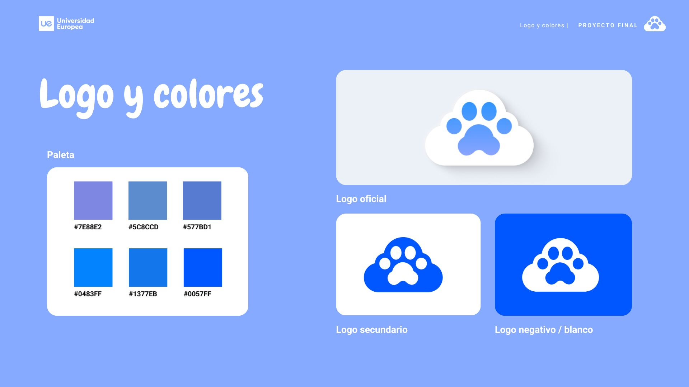
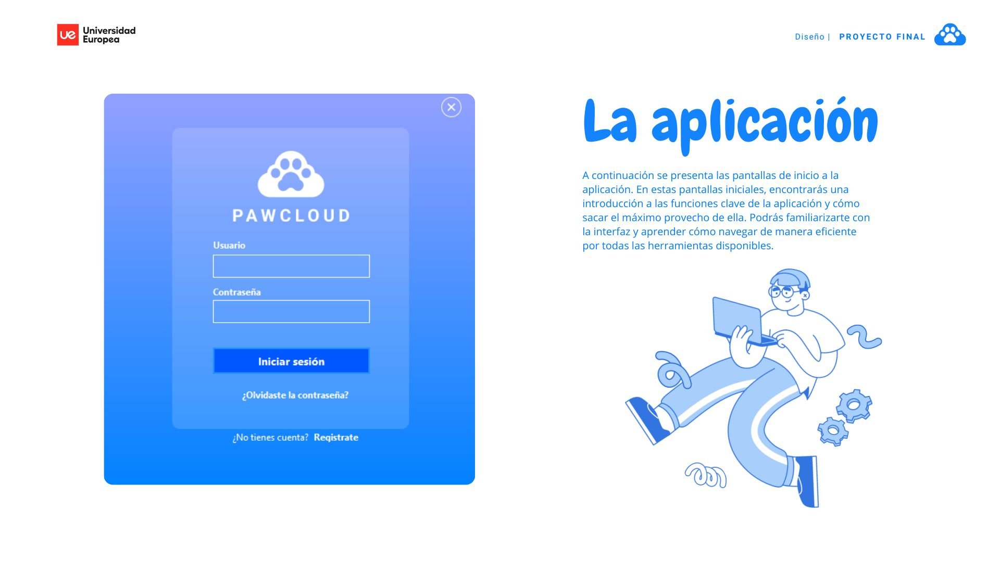
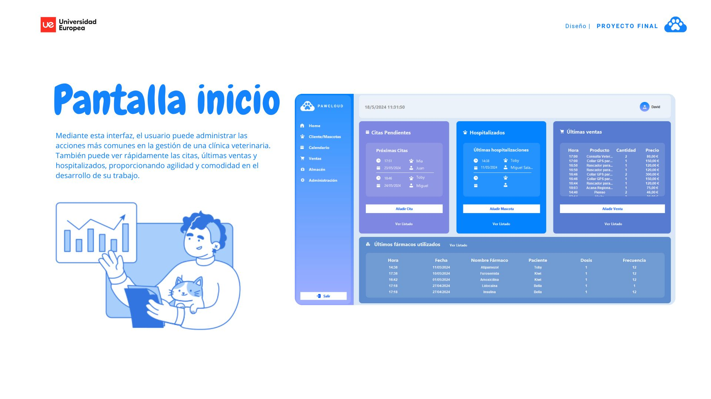
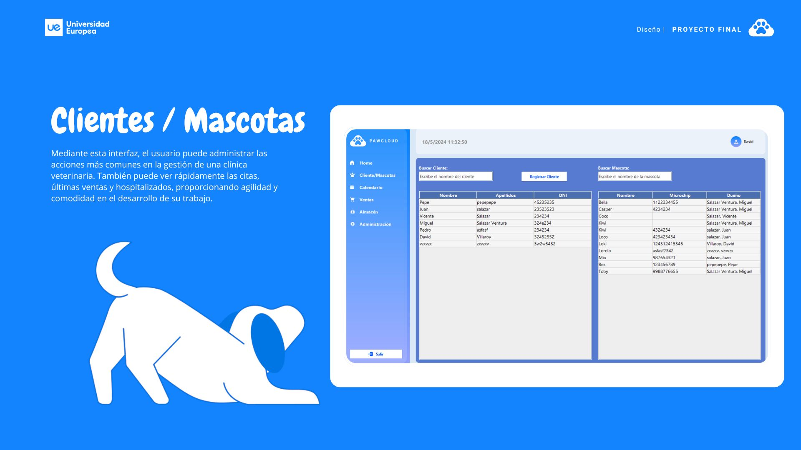
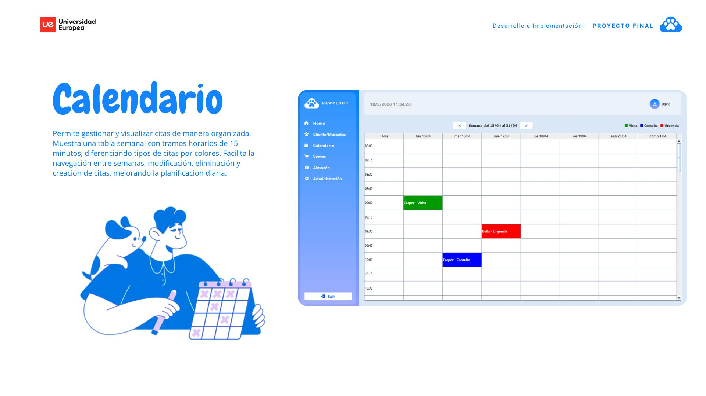
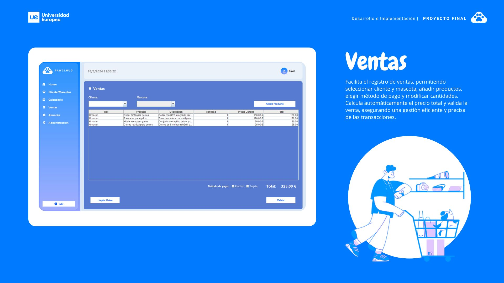
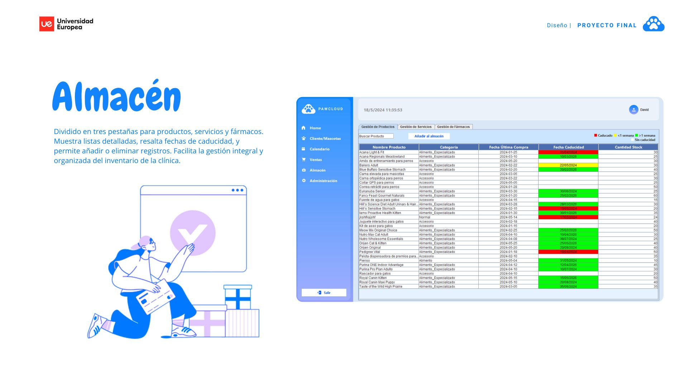
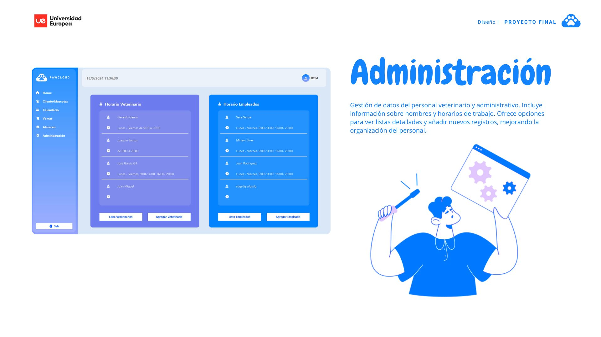
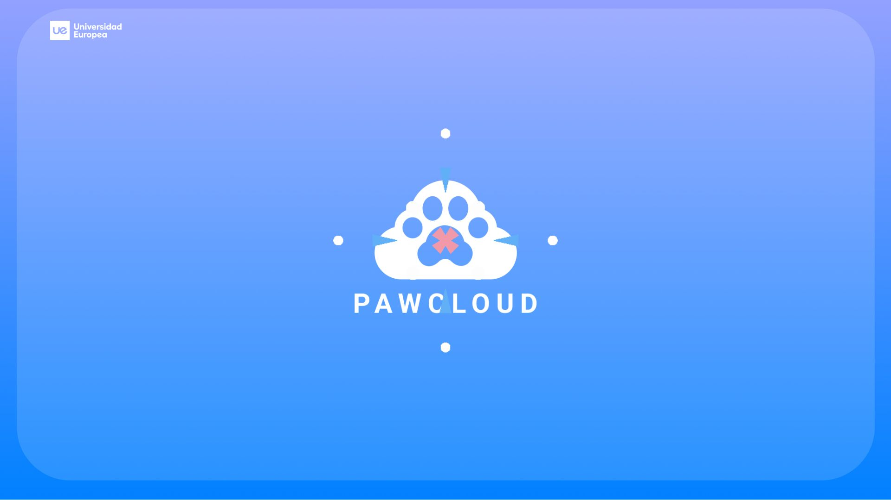

# 🐾 PawCloud - Gestión de Clínicas Veterinarias ☁️

**PawCloud** es una aplicación de escritorio desarrollada en **Java Swing**, diseñada para facilitar la gestión de clínicas veterinarias. Permite a los profesionales del sector veterinario administrar clientes, mascotas, historiales y citas, todo conectado a una base de datos remota en la nube mediante **MySQL alojado en AWS**.

Este proyecto fue desarrollado como parte del módulo de Proyecto Integrador del ciclo de **Desarrollo de Aplicaciones Multiplataforma (DAM)**.

---

## 🚀 Tecnologías utilizadas

- **Java 17**
- **Swing** (para interfaces gráficas)
- **MySQL** (gestión de datos)
- **AWS RDS** (base de datos remota)
- **Maven** (gestión de dependencias)
- **JDBC** (conexión con base de datos)

---

## ✨ Funcionalidades principales

- Gestión de clientes y mascotas
- Registro y edición de historiales médicos
- Planificación de citas veterinarias
- Interfaz amigable con formularios y tablas
- Conexión a base de datos remota (en la nube)
- Diseño estructurado y modular (MVC)

---

## 🧱 Arquitectura del proyecto

- **Modelo (Model)**: Clases de entidad para clientes, mascotas, citas...
- **Vista (View)**: Formularios e interfaces construidas con Java Swing
- **Controlador (Controller)**: Lógica de negocio, eventos y conexión a BBDD

---

## 📁 Estructura del proyecto

PawCloud/ ├── src/ │ ├── controller/ # Lógica de negocio y gestión de eventos │ ├── model/ # Clases de entidad y conexión a BBDD │ └── view/ # Formularios e interfaces Swing ├── resources/ │ └── logo.png # Logotipo e íconos ├── lib/  └── README.md

---

## 🗃️ Base de datos

La aplicación se conecta a una base de datos **MySQL en AWS**.

### Tablas principales:
- `clientes` – información personal
- `mascotas` – datos veterinarios y vínculos con cliente
- `citas` – agenda de visitas
- `historiales` – tratamientos, diagnósticos y evolución

### Conexión vía JDBC:

```java
String url = "jdbc:mysql://tu-host-rds.amazonaws.com:3306/pawcloud";
String user = "usuario";
String password = "contraseña";
Connection conn = DriverManager.getConnection(url, user, password);
---

## 🔐 Login


## 🏠 Panel Principal


## 📅 Calendario


## 💰 Panel Ventas


---

## 🖼️ Presentación del proyecto

Aquí se muestra una galería visual de la presentación de la aplicación:














---

## 👨‍💻 Autor

**Arturo Vázquez Paumard**  
📧 [arturovazquez1995@gmail.com](mailto:arturovazquez1995@gmail.com)  
💼 [LinkedIn](https://www.linkedin.com/in/arturovazquezpaumard/)  
💻 [GitHub](https://github.com/ArturoVazquez)
